# IM系统

## 1. 项目说明：

### 1.1 项目简介
基于go-zero实现一个分布式即时通讯系统，并接入大模型接口。

### 1.2 项目架构

## 2. 项目规划

### 2.1 业务功能清单

- 用户业务
- [x] 登录，注册 
- [x] 详情
- [x] 查找
- 社交业务
- [x] 好友功能（查找、添加、列表）
- [x] 群组 (进群、审核、列表)
-[x] 在线检测
- 聊天业务
- [x] 单聊
- [x] 异步数据存储
- [x] Ack确认机制
    - 目前只在服务端实现了ack确认， 要实现完整的三次ACK握手，需要在client中重写一遍server，调整msgChatTransfer消费者处理过程
- [x] 离线消息
- [x] 群聊
- [ ] 性能优化
- [ ] 多种聊天方式(文本，图片，语音)
- [ ] GPT接入
- [ ] 基于Langchain 聊天机器人文件，数据库信息读取

### 2.2 用到的技术

Go-Zero, GRPC, Protoc, docker,

### 3. 性能优化

- 未优化前

ws服务火焰图
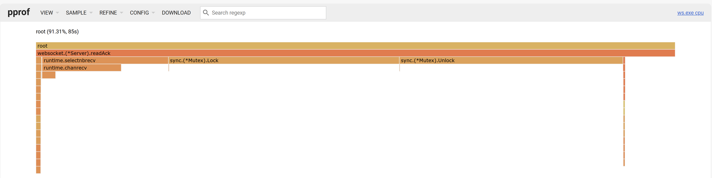
发送消息qps
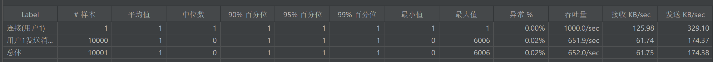
mq服务火焰图
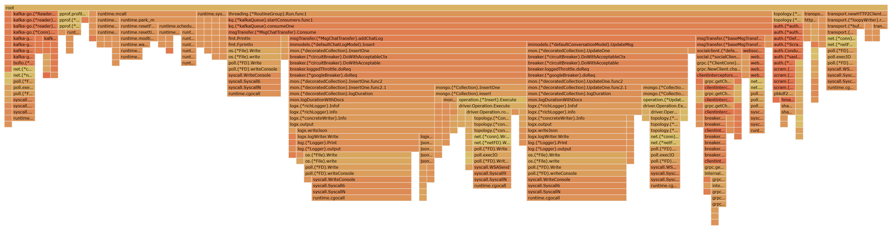
接收消息qps
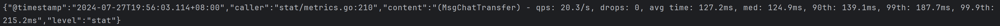
可以发现性能瓶颈主要在数据库操作

- V1:
使用协程以及合并插入优化

mq服务火焰图
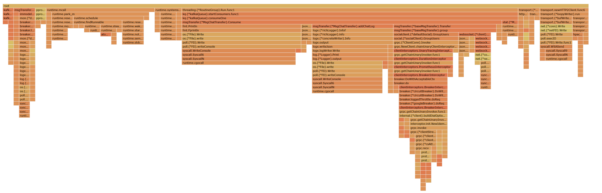

简化一些日志输入,并进一步优化

ws服务火焰图
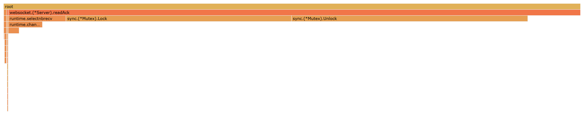
mq服务火焰图
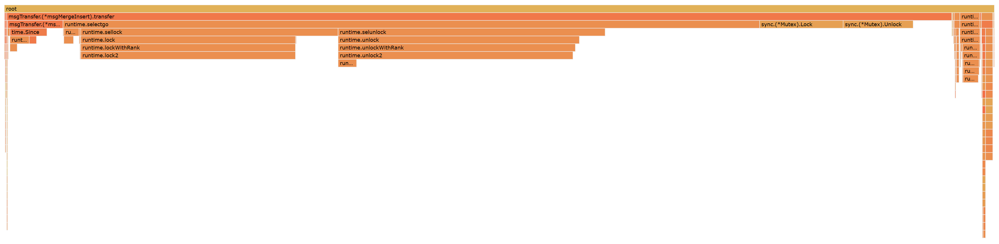

性能瓶颈在锁分布(锁受websocket阻塞影响)

- V2: 细化锁粒度

难点： websocket阻塞与死锁问题
1. c/s同时使用websocket的connection,因此需要加锁。c/s分别加锁可以保证在单独的client与server同步。
2. 但是websocket的connection是会阻塞的
3. 会出现下图的问题
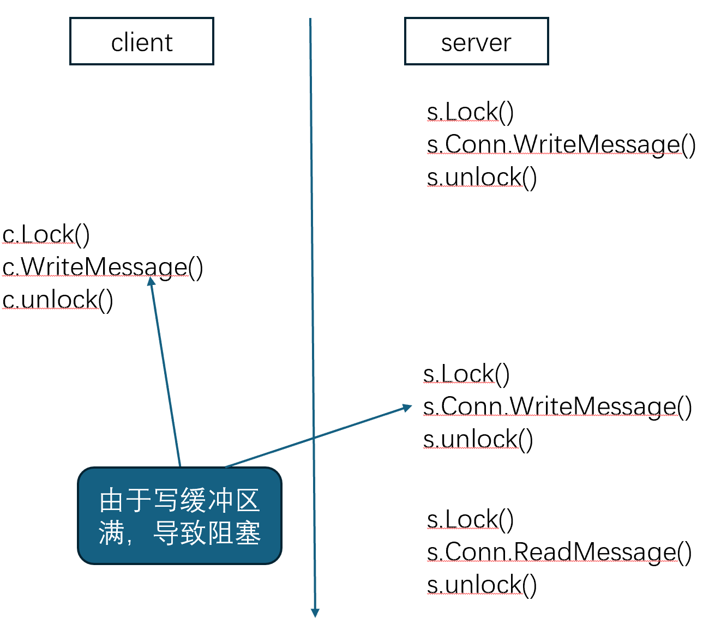
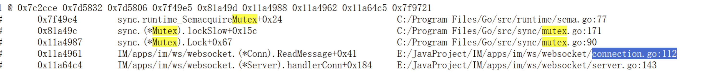
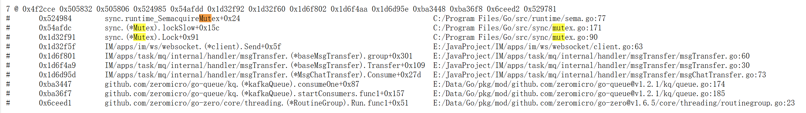

ws服务火焰图
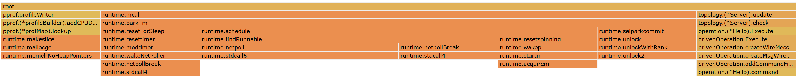

消息发送QPS：
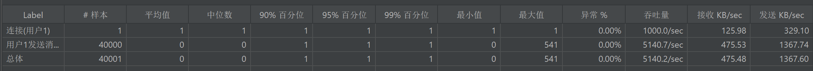

mq服务火焰图
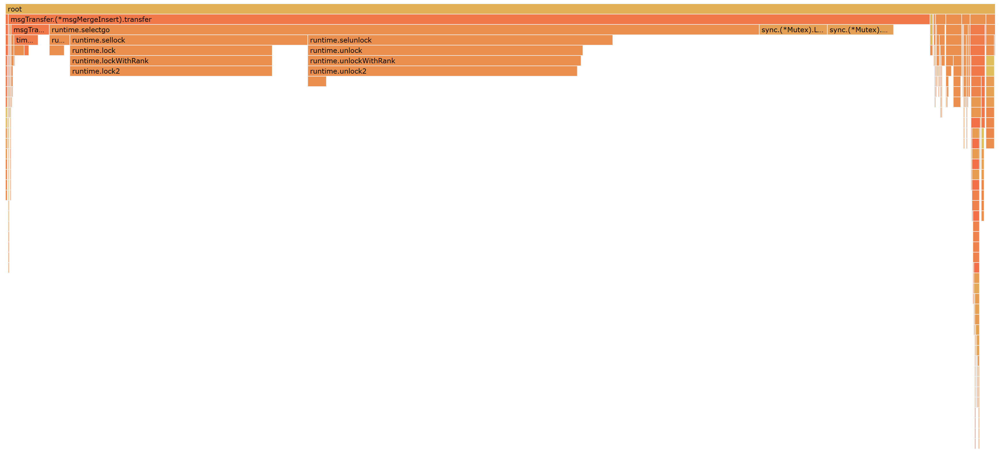

消息消费QPS:
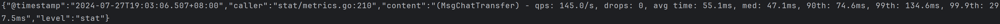

- V3: 多用户测试

6个用户同时进行收发，发送消息间隔为1ms

ws服务火焰图
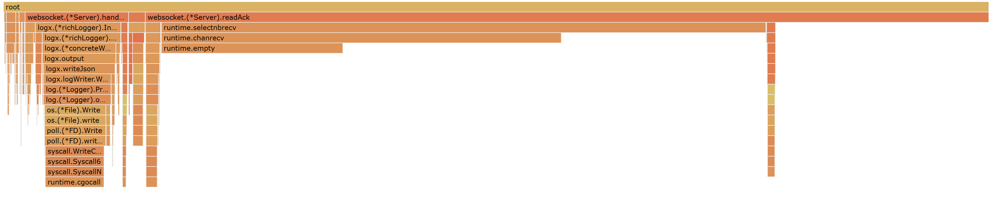

mq服务火焰图
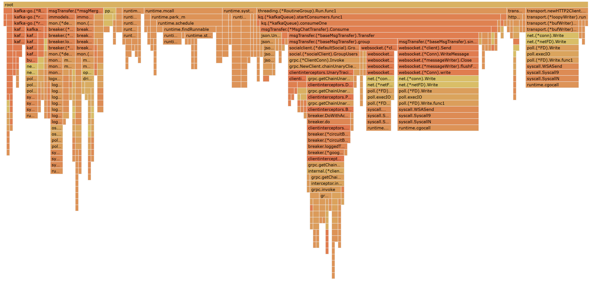

消息消费的QPS
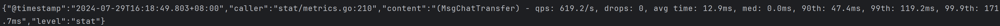

